# 🚇야생의 직장인

- **진행 기간**: 2023.2.20  ~ 2023.4.7

### 지하철역 위치기반 실시간 매칭 게임

### SSAFY 8기 특화 프로젝트

 

## 팀원 소개

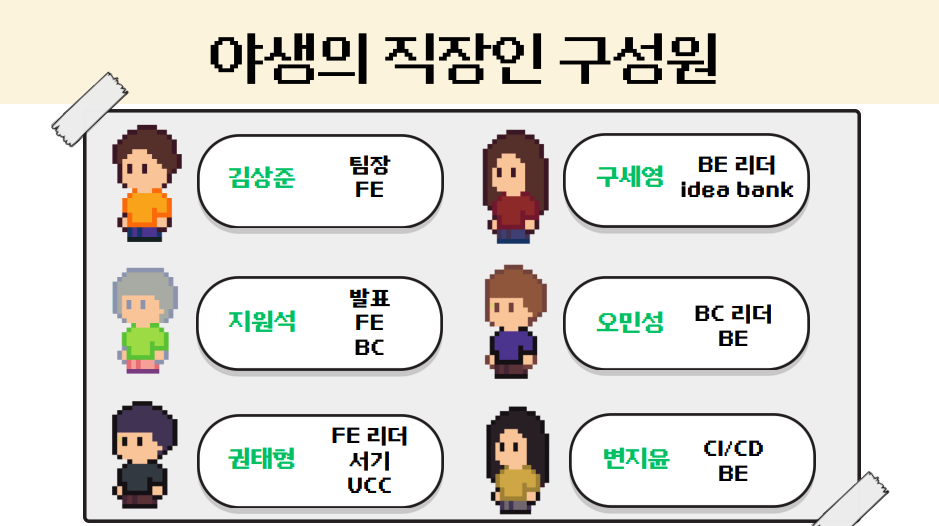

 

## **⚙​ 개발 환경 및 IDE**

**Frontend**
 

    

**Backend**

           

**Server**

   

**Blockchain**

   

**Cooperation & Communication**

   

## 기획 배경

- 긴 통근시간, 극심한 교통 혼잡, 정신적 육체적 스트레스 증가, 삶의 만족도를 떨어뜨립니다.

- 지하철을 출퇴근에만 다니는 지루하고 힘든 공간이 아닌 재미있는 공간으로 만들 수는 없을까라는 고민에서 출발하였습니다.

## 주요 기능

### 1. 코인 획득

- 수동 채굴 : 유저는 게임 대기화면에서 서류 아이템을 수집하고, 수집량 조건을 만족했을때 제출하여 코인을 얻을 수 있습니다.
- 자동 채굴 : 유저가 지하철을 타고 이동하며, 새로운 역에 최초 진입할 때 일정량의 코인을 획득할 수 있습니다.
  
  

 

### 2. PVP

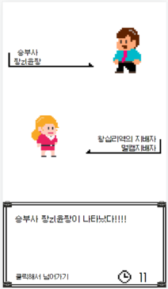 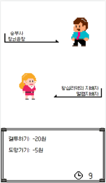 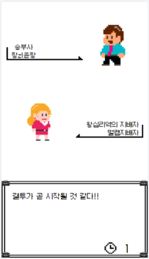

- 메인화면에서 같은 지하철역에 있는 유저들끼리 자동으로 랜덤 매칭되어 PVP를 진행하게 됩니다.

- 매칭이 된 유저 2명은 "결투하기" 와 "도망치기" 액션을 선택할 수 있습니다.

- 도망치기를 선택한 경우, 50% 확률로 일정량의 도망비를 지불하고 도망에 성공합니다.

- 결투가 성사된 경우, 다음과 같은 두가지 게임을 랜덤으로 진행합니다.
1. 지하철 자리 앉기 게임

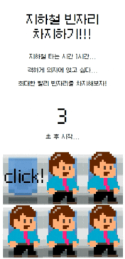 

2. 회식비 정산 게임

 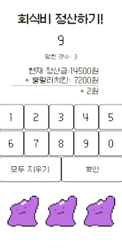

- 위 게임에 대한 결과 화면입니다.

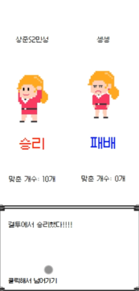
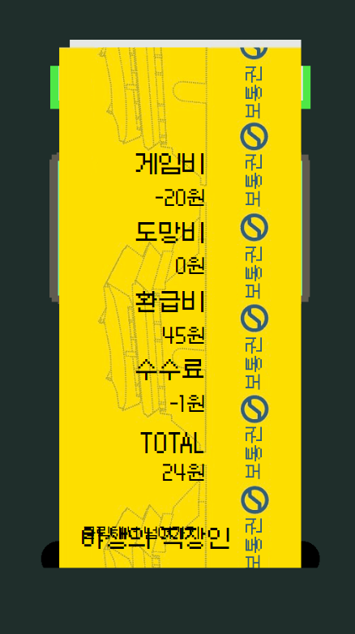

### 3. 지하철 역 투자

- 유저는 보유한 코인으로 2호선 지하철역에 대한 투자를 할 수 있습니다.
- 어떤 지하철역에 대한 지분율을 갖고 있을때, 해당 역에서 진행되는 모든 게임의 수수료를 지분율에 비례하여 획득할 수 있습니다.

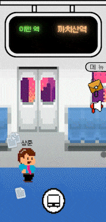
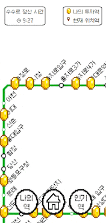

- 투자가 많이 일어나는 인기역과 내가 투자한 역을 확인할 수 있습니다.

 

### 4. 칭호 시스템

- 유저의 닉네임을 수식할 수 있는 칭호는 지배자와 일반 칭호로 나누어지게 됩니다.
1. 지배자 : 어떤 지하철역에서 지분율 1위를 확보하고 있는 유저는 해당역의 지배자 칭호를 획득할 수 있습니다.

2. 일반 칭호 : 유저는 특정 히든 미션을 달성했을 때, 관련된 칭호를 얻을 수 있습니다.

 

### 5. 특정 지하철역 이벤트 오브젝트

- 위치기반 서비스의 특징을 살려, 특정 지하철역들에 진입하였을 때 출몰하는 오브젝트를 만들었습니다.

 

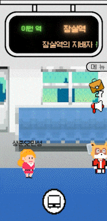

 

## ERD

## 시스템 아키텍쳐

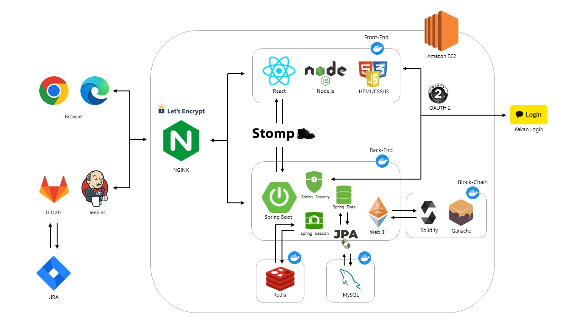
